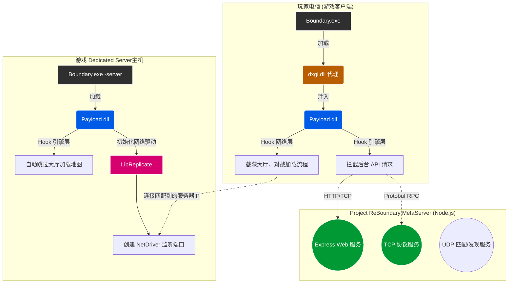

# Project ReBoundary 架构总览

Project ReBoundary 是一个典型的 CS (Client-Server) 分布式架构拓展，主要分为以下几个主要实体：

1. **游戏客户端 (Game Client)**：玩家实际运行的《边境》游戏程序。
2. **逻辑/元数据服务器 (MetaServer)**：取代官方后台服务器，处理账号、通知、战利品、匹配等。
3. **专属服务器 (Dedicated Server / DS)**：一局《边境》游戏主机，负责物理演算、玩家位置同步与伤害判定。

在 Project ReBoundary 中，整个架构是如何协同工作的呢？

## 核心架构图

## 协同工作原理

官方版本的游戏通过内置的代码连接到官方的服务器，且有很多强校验的流程（如 `ProcessEvent` 和 `TickFlush`）。
而在 ReBoundary 中：

### 1. ReBoundaryMain (Payload & Injector)
这是用 C++ 编写的 DLL 库及注入器（利用 `dxgi.dll` 代理机制，游戏启动时会自动加载名为 dxgi 的假的 DirectX 图形接口库，进而加载我们的 Payload.dll）。
- 此模块是干预游戏客户端与 DS 的绝对核心。它通过 SafetyHook 在内存中实时篡改游戏的各种函数。
- **客户端侧**: 将游戏指向官方 Meta 服务器的请求，强制重定向到我们自己的 `ReBoundaryMetaServer` IP 上（如 `127.0.0.1` 或是具体的局域网/公网IP）。绕过一些在未连接官方服务器时导致游戏崩溃的逻辑。
- **DS 服务侧**: 如果玩家以 `-server` 参数启动，Payload.dll 就会自动开启一个监听端口，初始化网络驱动（NetDriver），并使用项目内的 `LibReplicate` 自定义网络同步库来接管 Unreal Engine 复杂的对象的同步复制（Replication）过程。这个模块保证了玩家间的移动、开火都能正确同步。

### 2. ReBoundaryMetaServer (逻辑服务器)
由于 Payload 拦截并重定向了所有的后台通讯，这些请求都来到由 Node.js 构建的 MetaServer。
- **服务接口**：提供 TCP/HTTP/UDP 几类接口。
- **Protobuf 反馈**：游戏客户端使用 Protobuf 来包裹 RPC 数据请求。MetaServer 以二进制流的方式接收，用 `./game/proto` 中预置的结构体解码：
  - 处理 `/notification.Notification/QueryNotification` 等接口，返回公告和更新说明。
  - 处理 `/matchmaking.Matchmaking/StartUnityMatchmaking` 提供对局匹配功能。
  - 处理各类角色等级、武器解锁、大厅队伍组建等业务。
- **游戏导流**：当客户端请求连接加入比赛时，MetaServer 将他们导向我们通过 `Payload` 搭建起来的专属服务器 (DS)。

通过这两个仓库紧密结合：**MetaServer 提供能让游戏正常运行进入主菜单的虚假后台数据，Payload.dll 提供服务端与客户端在断绝官方连接后仍能互相寻找并同步的核心机制**，ReBoundary 成功让玩家脱离官方限制，实现局域网或私服联机。
