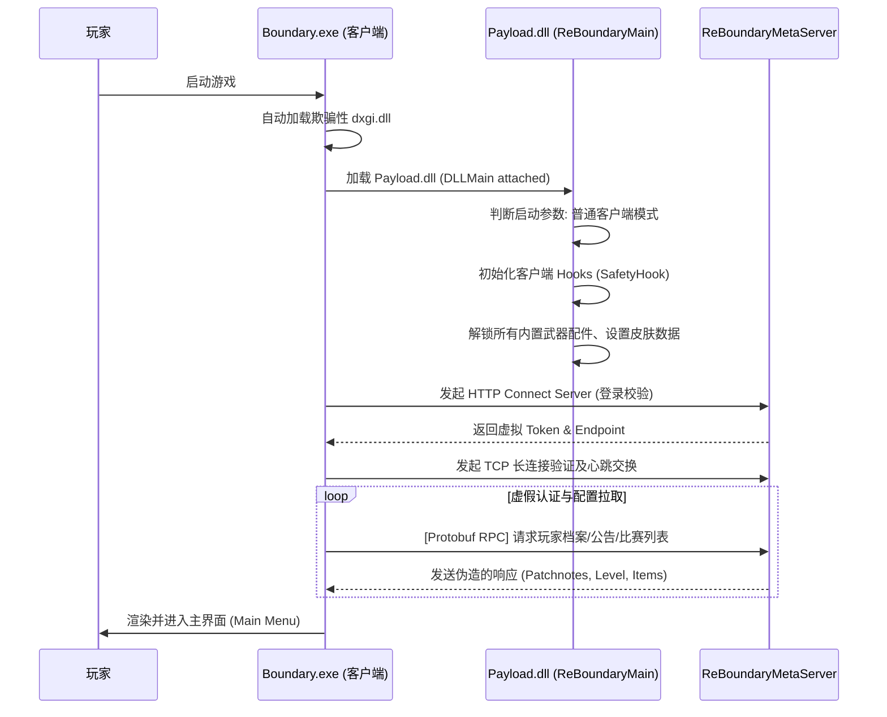
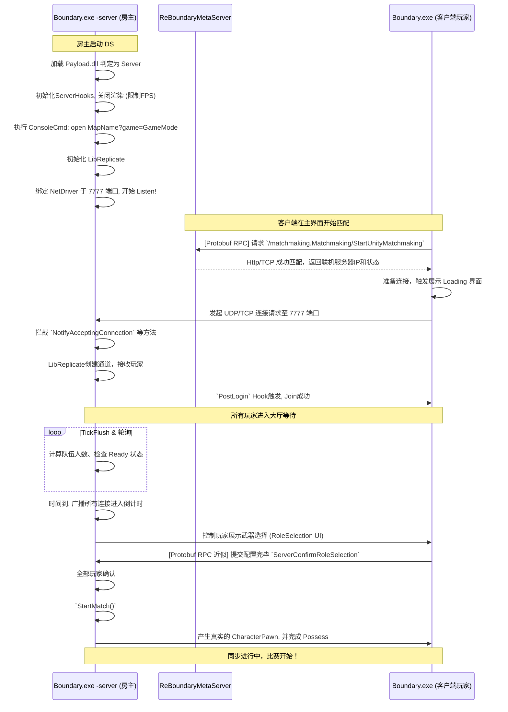
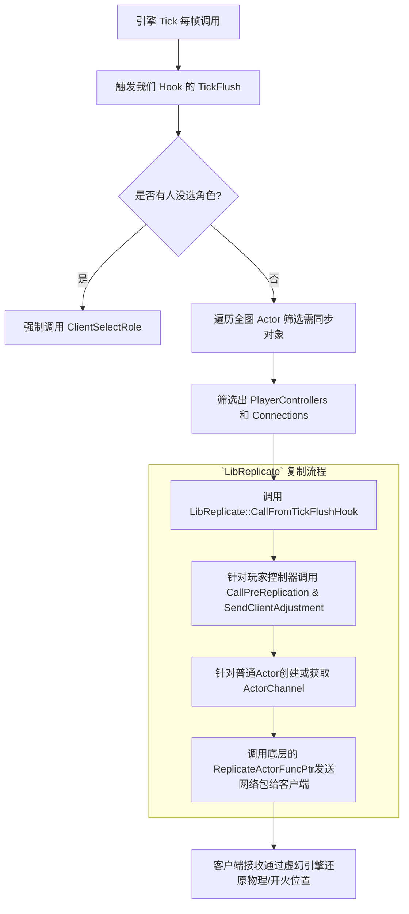

# 流程图

本文档展示了两个子仓库协同工作下的核心游戏流程：包括**客户端冷启动过程**以及**玩家加入比赛打通联机的全过程**。

## 客户端启动及初始化流程

## 创建与加入比赛联机流程

此流程展示了如果一个玩家作为房主 (Server)，其他玩家作为客户端 (Client)，整个联机的打通方式。

## 网络同步循环 (LibReplicate Hook 工作流)

这是游戏实时对决时，服务端如何向客户端下发数据的流程，它完全接管了官方废弃或缺失的复制过程：

